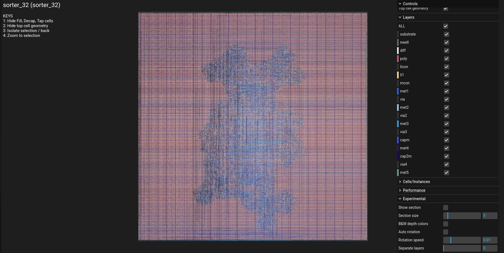
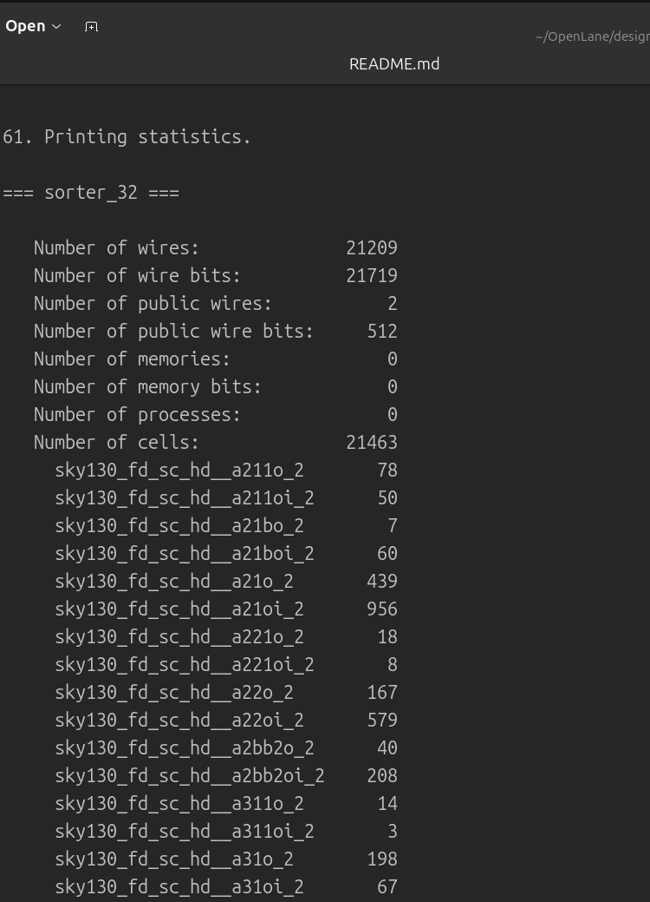
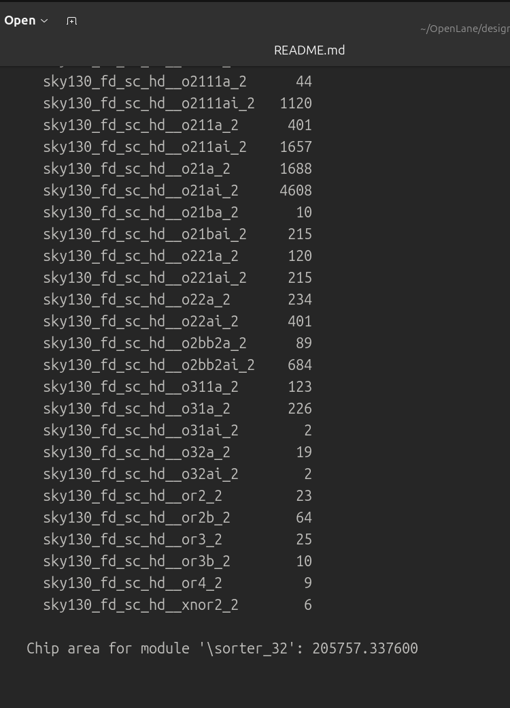
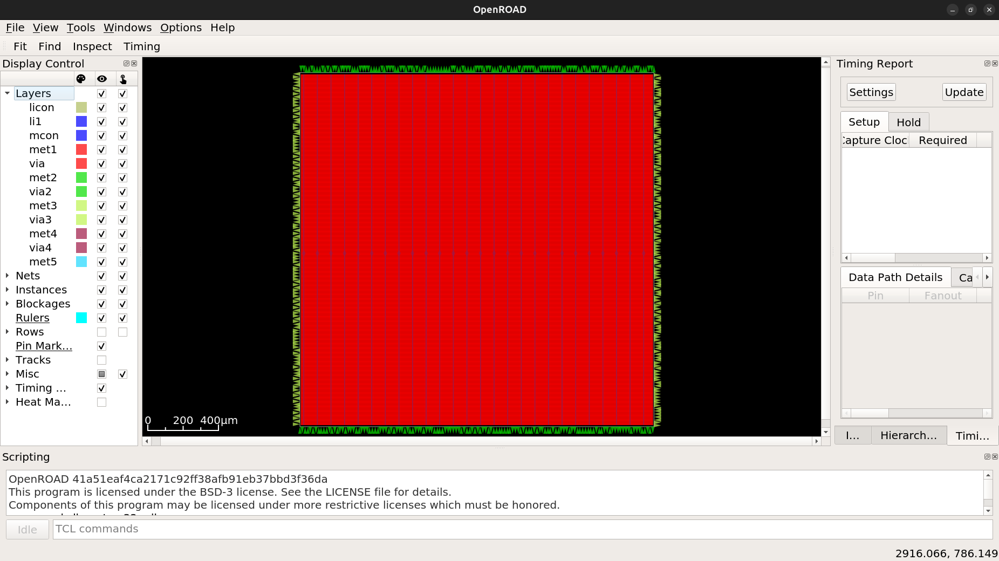
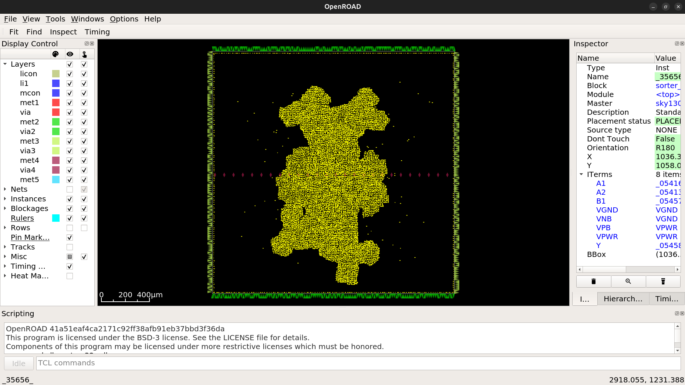
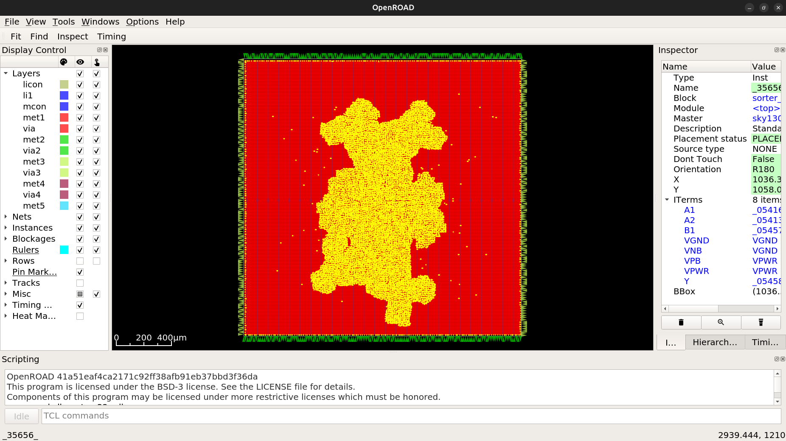
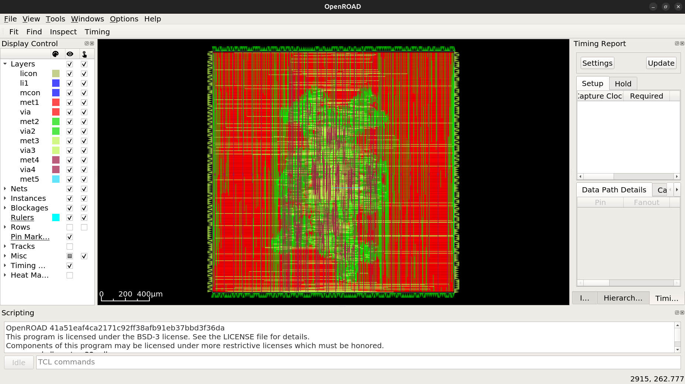
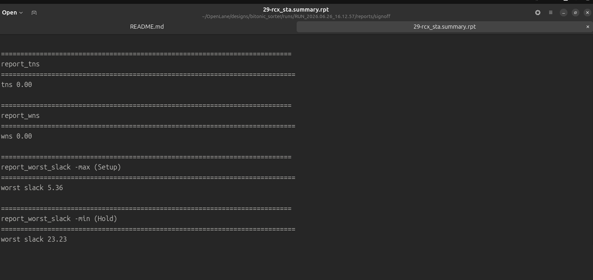
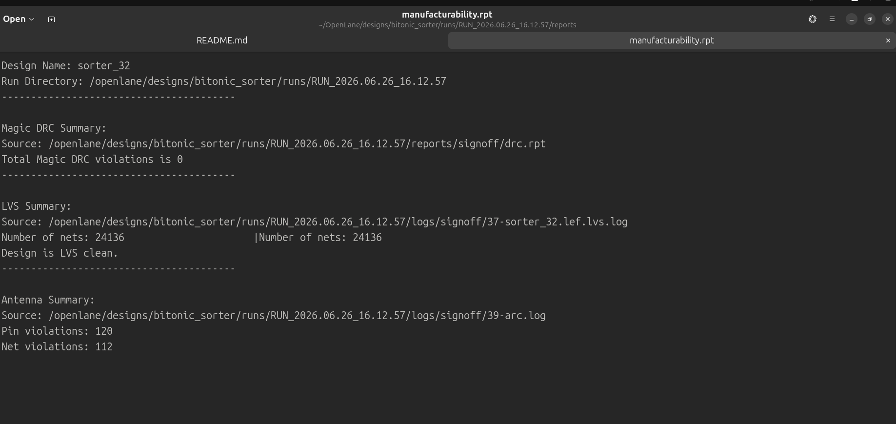

<div align="center">

# ⛓️ 32-Element Bitonic Sorting Network
### A Silicon Journey: From Sorting Math to Physical GDSII
32 Element (8 Bit) Bitonic Sorting Network from RTL to GDSII using Openlane and Sky130 PDK
[](https://github.com/The-OpenROAD-Project/OpenLane)
[](https://github.com/google/skywater-pdk)
[](#)
[](#)

*Tackling logic butterfly topologies, massive wire congestion, and single-cycle hardware processing.*



---

**[What is a Bitonic Sorter?](#-what-is-a-bitonic-sorter) • [The Automation Advantage](#-the-automation-advantage) • [Physical Challenges](#-the-physical-design-challenge) • [Visual Journey](#-the-rtl-to-gdsii-visual-journey) • [Reproduce](#-how-to-reproduce)**

</div>

---

## 🧠 What is a Bitonic Sorter?

In software, sorting is a sequential process: loops, memory access, and multiple clock cycles. In hardware, we can do it **instantaneously.**

A **Bitonic Sorting Network** is a purely combinational circuit. It takes an unsorted array of numbers and routes them through a fixed, crisscrossing "butterfly" network of Compare-and-Swap (CAS) units. By carefully arranging these crossings, the data sorts itself automatically as it flows from input to output in a single clock cycle.


---

## ⚡ The Automation Advantage: Python Generators

To build a 32-element sorter, you need **240 unique Compare-and-Swap nodes** connected in a highly specific butterfly pattern. Designing this structure by hand is error-prone and inefficient.

> 🛠️ **Why use Python Generators?**
> 1. **Mathematical Precision:** We use a Python script (`sorter_generator.py`) to calculate the exact routing topology. This guarantees the butterfly crossbar is logically perfect before a single gate is synthesized.
> 2. **Scalability:** If we decide to upgrade to a 64-element sorter, we simply change one variable in our script, and the entire RTL and testbench are recreated instantly.
> 3. **Verification:** The testbench generator (`sorter_tb_generator.py`) automatically builds a verification suite that stress-tests the logic with random hex patterns and worst-case descending-order arrays.

---

## 💡 The Physical Design Challenge

Building a 32-element sorter isn't just about logic; it's about physics:
1. **The "Spiderweb" Routing:** The wires cross in an exponentially increasing pattern, creating extreme **metal layer congestion** in the center of the die.
2. **The Buffer Explosion:** Thousands of segments mean signal integrity is vital. Without precise buffer insertion, the wires suffer from massive RC delay.
3. **The Router's "Boss Fight":** Standard routers often choke on these patterns. We used a **20% placement density** strategy to give the TritonRoute engine enough "breathing room" to weave the tracks without shorts (DRC violations).

---

---

## 📖 The RTL-to-GDSII Visual Journey

The RTL-to-GDSII flow is the "assembly line" of semiconductor manufacturing. It transforms abstract Verilog code into physical metal layers on a silicon chip. Here is how we navigated that transformation:

### 1️⃣ Logic Synthesis (The "Blueprint")
We use **Yosys** to translate our behavioral Verilog into a netlist—a massive collection of standard logic gates (AND, OR, XOR) available in the Sky130 library.
<p align="center">
  
  
</p>

### 2️⃣ Floorplanning & Power Delivery (The "Foundation")
We define the silicon die boundaries and build the Power Delivery Network (PDN). Think of this as the electrical grid of the chip, ensuring every gate receives a stable 1.8V power supply.
<p align="center">
  
</p>

### 3️⃣ Placement (The "Construction")
OpenROAD assigns physical coordinates to every standard cell. By setting a **20% placement density**, we strategically left 80% of the silicon empty to allow for the complex wiring required by the Bitonic crossbar.
<p align="center">
  
  
</p>

### 4️⃣ Routing (The "Wiring")
This is where the magic happens. Using **TritonRoute**, the tool weaves thousands of physical metal paths connecting our 240 logic nodes. The result is a dense, high-performance "butterfly" interconnect.
<p align="center">
  
</p>

### 5️⃣ Signoff & Manufacturability (The "Quality Inspection")
Before the design can be etched into silicon, it must pass three final tests:
* **DRC (Design Rule Check):** Ensures no physical metal layers violate manufacturing spacing rules.
* **LVS (Layout vs. Schematic):** Confirms the final physical wires match our original logic.
* **STA (Static Timing Analysis):** Proves the signal propagates fast enough to meet our timing requirements.

<p align="center">
  
  
</p>

---

## 🛠️ The Big Picture


By completing this flow, we moved from **Idea → Logic → Geometry → Manufacturing Blueprint (GDSII).** This project demonstrates the ability to manage the actual physics of electricity, timing, and spatial congestion—the fundamental skills of a modern Physical Design Engineer.

### 📊 Key Statistics
| Metric | Value |
| :--- | :--- |
| **Logic Nodes (CAS)** | `240` |
| **Total Standard Cells** | `21,463` |
| **Magic DRC** | `0` Violations |
| **Netgen LVS** | `Clean` |

---

## 📂 Repository Structure

```text
├── bitonic_sorter_ss/     # Visuals and screenshots
├── src/                   # Verilog source codes
├── README.md              # Project documentation
├── config.json            # OpenLane configuration
├── sorter_generator.py    # Python script for RTL generation
└── sorter_tb_generator.py # Python script for TB generation
```

# How to Reproduce

# Step 1: Generate the RTL & TB
```
python3 sorter_generator.py
python3 sorter_tb_generator.py
```
# Step 2: Run the Automated Flow

1. Mount the OpenLane Docker
```
make mount

# 2. Run the physical design pipeline
./flow.tcl -design bitonic_sorter
```
# 🤝 Acknowledgments

A huge thank you to the open-source silicon community, the OpenROAD project, and Google/SkyWater for democratizing hardware design!
